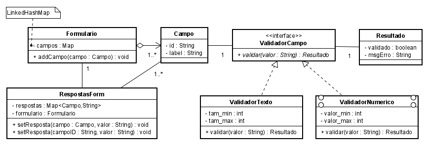

**Universidade Federal da Paraíba - UFPB** \
**Centro de Ciências Exatas e Educação - CCAE** \
**Departamento de Ciências Exatas - DCX**

**Professor:** [Rodrigo Rebouças de Almeida](http://rodrigor.dcx.ufpb.br)

# Atividade 

1) Implemente a classe ValidadorNumerico, de acordo com o diagrama abaixo, e implemente um teste para o ValidadorNumerico.

2) Implemente uma classe 'ValidadorData' e implemente um teste que verifique se o validador está funcionando.
3) Implemente uma classe 'ValidadorSenha'
   - Deve ser possível estabelecer uma senha com tamanho mínimo e máximo.
   - A senha deve ter pelo menos uma letra minuscula, uma maiuscula e um número.